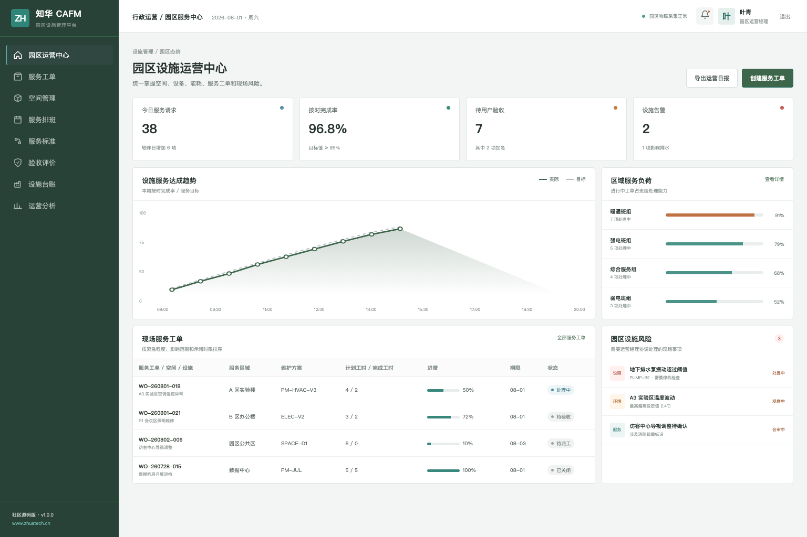
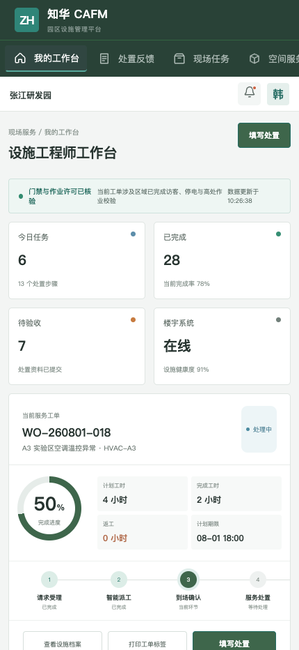

# ZhuaTech CAFM：面向真实园区服务现场

空间是否可用、设备是否健康、工单是否按时、员工是否满意——园区运营需要一套共同的事实来源。

ZhuaTech CAFM 是知华科技（上海如静知华信息科技有限公司）提供的园区设施管理社区源码版。了解商业版本和定制服务，请访问[知华科技官网](https://www.zhuatech.cn/)。

## 两类角色，两套工作视角

### 园区运营经理

管理端聚合空间、设施、服务工单、班组负荷、SLA、环境和现场风险。



### 设施服务工程师

H5 工作台支持接单、到场、巡检、处置反馈、材料登记、用户验收和风险上报。



## 产品模块

| 运营域 | 主要能力 |
| --- | --- |
| 空间管理 | 园区、楼宇、楼层、房间、工位与使用状态 |
| 设施台账 | 分类、位置、健康度、巡检、保养和维修履历 |
| 服务工单 | 受理、派工、到场、处置、验收、评价和返工 |
| 现场服务 | 会议室、搬迁、访客、保洁和综合保障 |
| 运营分析 | SLA、满意度、空间利用、设备健康、能耗和成本 |

所有园区、设备、工单、人员与指标均为演示用虚构数据。

## 运行社区源码版

```bash
cd frontend
npm install
npm run dev:demo
```

访问 `http://localhost:5173`。园区管理端：`planner / Demo@2026`；工程师端：`operator / Demo@2026`。

完整部署：

```bash
cp .env.example .env
docker compose up --build
```

项目使用 Java 21、Spring Boot、Spring Security、JWT、JPA、Flyway、MySQL 8、Vue 3、Pinia、Vite、Nginx 和 Docker Compose。Java 包名 `cn.zhuatech.cafm`，数据库 `zhuatech_cafm`。

## 请先阅读授权边界

本项目只能用于个人学习、研究和非商业技术交流，**不得商用**。公司内部生产使用、商业项目交付、SaaS、收费培训、咨询实施、品牌替换或商业再分发等用途，必须获得上海如静知华信息科技有限公司的书面授权。详细条款见 [LICENSE](LICENSE)。

需要智慧园区、IFM、BMS/IoT 对接、移动巡检、私有化部署或深度定制，可通过官网或以下微信二维码联系知华科技：

| 微信联系 1 | 微信联系 2 |
| --- | --- |
|  |  |

[部署说明](deploy/README.md) · [接口文档](docs/api.md) · [数据库说明](docs/database.md) · [贡献指南](CONTRIBUTING.md)

关键词：CAFM 系统源码、园区设施管理、空间管理、设施工单、智慧园区、Java CAFM、Vue 设施管理、知华科技。
